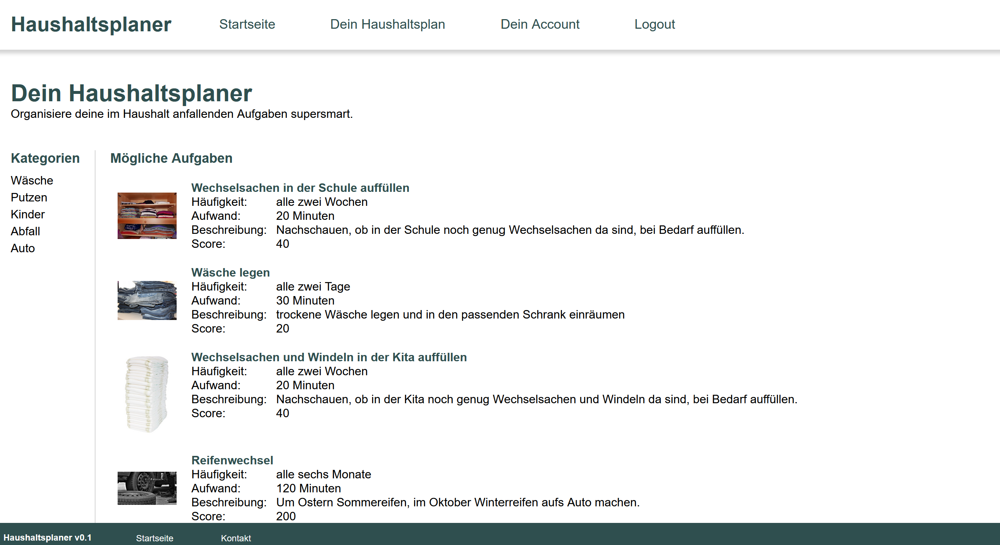
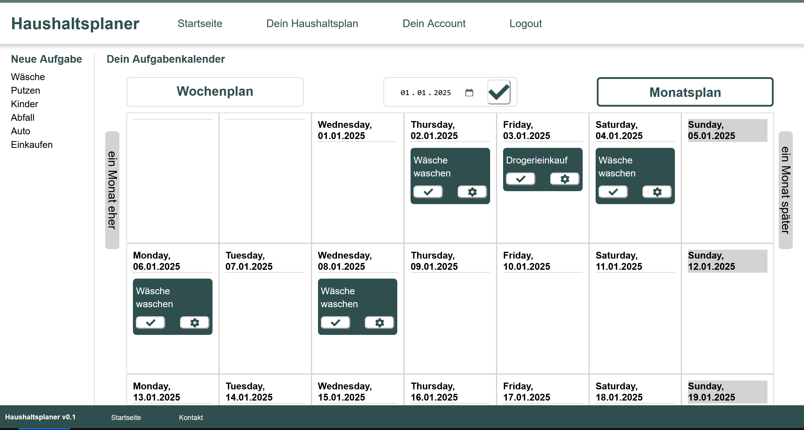

# Haushaltsplaner

This webapp is designed to be used in German language, so all the descriptions here are in German as well. Please feel free to use the translator of your choice if this is not your favorite language :o) 

## Worum geht es?
Der Haushaltsplaner ist eine PHP basierte Webapp, vor allem um mit PHP vertrauter zu werden. In einer Version 1.0 sollte die Anwendung einem registrierten Nutzer erlauben, typische Haushaltsaufgaben zu organisieren. Außerdem ist eine gamification Komponente geplant.

## Wie sieht es aus?
Hier eine kleine Impression der Startseite, wie sie für einen angemeldeten Nutzer aussieht:

Sind ein paar Aufgaben eingeplant, sieht die Monatsübersicht etwa so aus:

## Wie kann man die Anwendung benutzen?
Für die Entwicklung verwende ich xampp, insbesondere den Apache Server und die Mysql Datenbank. Um die Anwendung einfach mal zu starten, reicht es einen Apache Webserver zu starten und das Hauptverzeichnis des Repositories als root-Verzeichnis für den Server zu setzen.

Um einige Beispieldaten aus der Datenbank für die dynamische Inhaltsanzeige zu laden, kann das SQL Skript [haushaltsplaner_dump.sql](haushaltsplaner_dump.sql) in einen aktiven MYSQL oder MariaDB Server importiert werden. Damit wird die Webanwendung wesentlich hübscher ;-)
